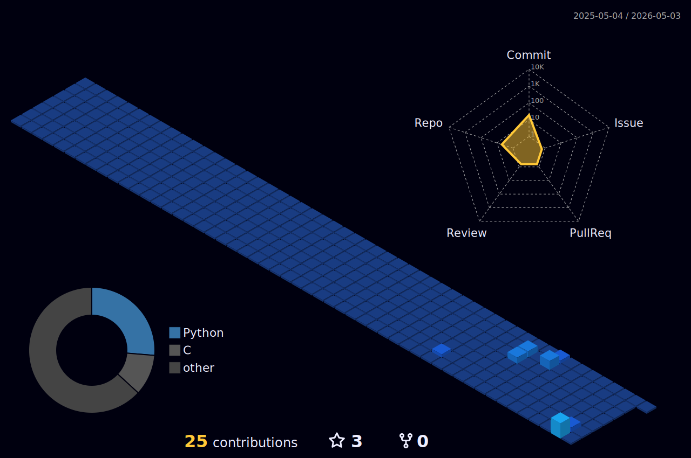

  

### 🏆 Achievements & Milestones

  

---

### 📊 3D Contribution Architecture

  

---

### 🛠️ Technical Arsenal

  
  
  
  
  
  

---

### 📈 System Analytics

  
  

---

### 🚀 Featured Daemons
* **[SysMon (Linux)](https://github.com/mrshoaibxbd/sysmon-linux)**: Native C monitoring dashboard.
* **[Lenovo Power Control](https://github.com/mrshoaibxbd/lenovo-power-control)**: ACPI firmware bridge for battery management.
* **[Ubuntu Setup Engine](https://github.com/mrshoaibxbd/ubuntu-setup-engine)**: State-aware system optimizer for Ubuntu 24.04 LTS.

  <a href="https://shoaib.yzz.me">🌐 Personal Website</a> • <a href="mailto:shoaibxbd@gmail.com">📧 Email Me</a>

