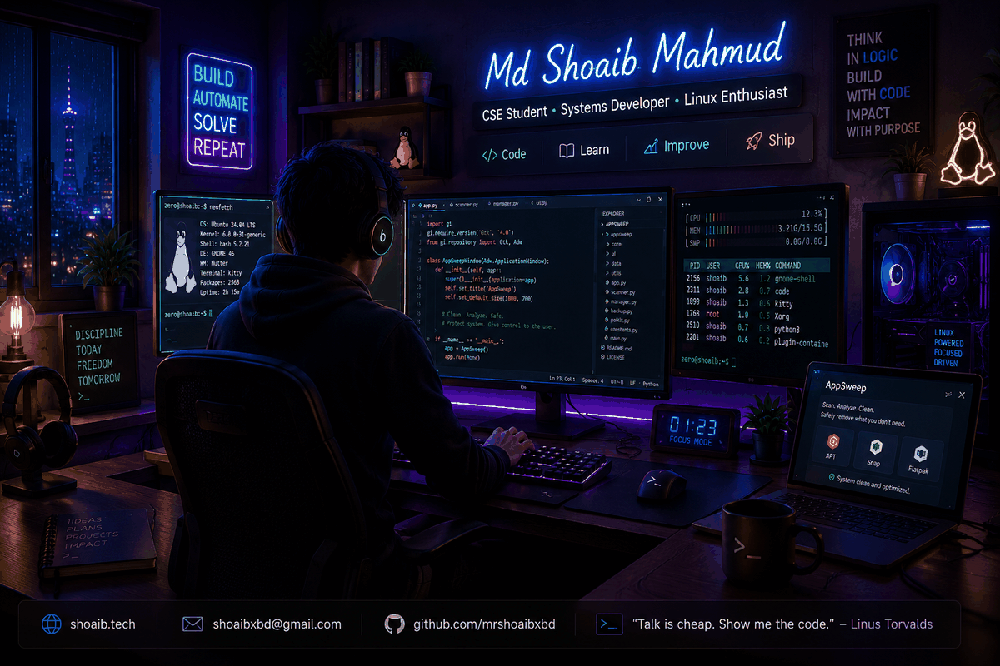
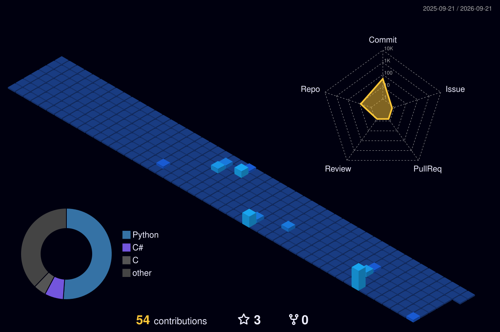

  

<h1 align="center">Md Shoaib Mahmud</h1>

  <strong>CSE Student · Systems Developer · Linux Enthusiast</strong>

  <a href="https://shoaib.tech">Website</a>
  ·
  <a href="mailto:shoaibxbd@gmail.com">Email</a>
  ·
  <a href="https://github.com/mrshoaibxbd?tab=repositories">Repositories</a>

---

## About me

I am a Computer Science and Engineering student from Bangladesh who enjoys building practical software, Linux desktop applications, system utilities, automation tools, and web projects.

I prefer learning by creating real projects, studying how systems work, and improving software through testing and careful iteration.

    shoaib@linux:~$ whoami

    CSE student
    Linux enthusiast
    Software developer
    Problem solver
    Always learning

## Current focus

- Native Linux and Ubuntu applications
- System utilities and desktop tools
- Python with GTK 4 and Libadwaita
- C and C# programming
- Object-oriented programming with Java
- PHP, SQL, and MySQL
- HTML and CSS
- Bash and Linux scripting
- Git and GitHub workflows
- Software testing, linting, and packaging

## Languages and technologies

  

  
  
  
  
  

## Featured projects

<table>
<tr>
<td width="50%" valign="top">

### [AppSweep](https://github.com/mrshoaibxbd/appsweep)

A native GTK 4 application for safely reviewing and removing software installed through APT, Snap, and Flatpak.

It includes removal analysis, safety protections, application-data detection, verified rollback backups, PolicyKit integration, automated tests, and Debian packaging.

**Technologies:** Python, GTK 4, Libadwaita, PolicyKit, Meson, Debian packaging

[Download the latest release](https://github.com/mrshoaibxbd/appsweep/releases/latest)

</td>
<td width="50%" valign="top">

### [SysMon for Linux](https://github.com/mrshoaibxbd/sysmon-linux)

A native Linux system-monitoring project focused on displaying useful system information and performance data.

**Technologies:** C, Linux, system programming

</td>
</tr>

<tr>
<td width="50%" valign="top">

### [Lenovo Power Control](https://github.com/mrshoaibxbd/lenovo-power-control)

A Linux utility for controlling supported Lenovo battery and power-management behavior.

**Technologies:** C, Linux, ACPI, system utilities

</td>
<td width="50%" valign="top">

### [Ubuntu Setup Engine](https://github.com/mrshoaibxbd/ubuntu-setup-engine)

A state-aware Ubuntu configuration and automation project designed to simplify system setup.

**Technologies:** Linux, Bash, automation, system configuration

</td>
</tr>
</table>

## GitHub overview

  
  

## Contribution activity

  

---

  <em>Code. Learn. Improve. Ship.</em>

  <a href="https://shoaib.tech">shoaib.tech</a>
  ·
  <a href="mailto:shoaibxbd@gmail.com">shoaibxbd@gmail.com</a>

